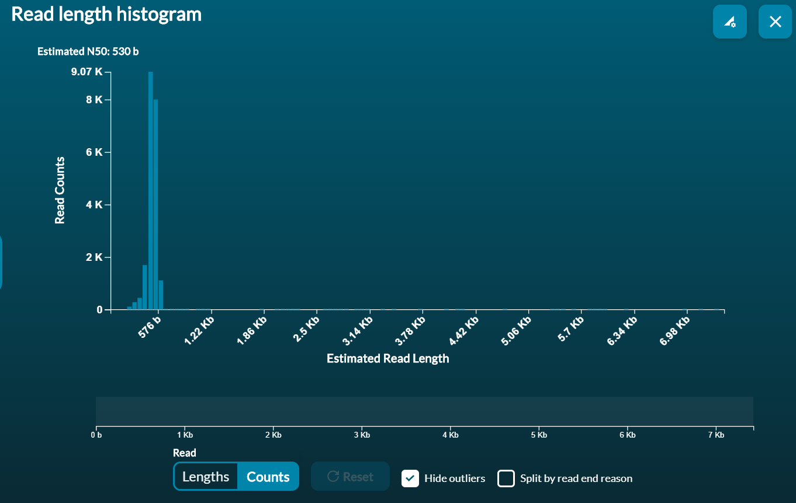
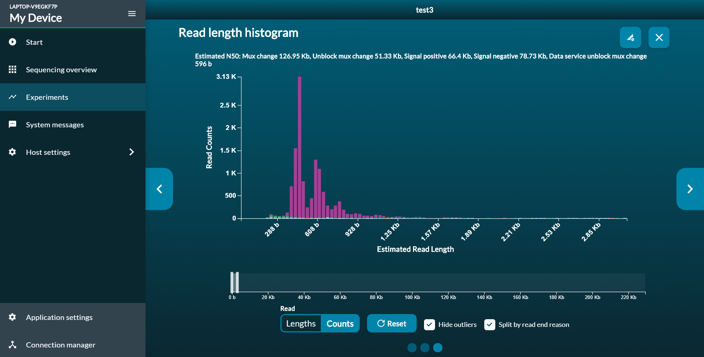

# GUI with Qt 5.15.0 for ReadBouncer (build from source code):
  
**Requirements for Qt 5.15.0 (All this kits are automatically installed with Qt)**: 

* CDB Debugger 
* MSVC 2019  x86_64
* QMake 
* CMake tool for QT 
* UI Designer 
* To run on Windows you need <= Qt 5.15.0 no Qt 6 because of some seqAn2 errors (see similar issues above).

-------------------------------------------------------------------------------------------------------------------------
**Installing Qt (Windows + Linux)**: 
* Download Qt installer from (https://www.qt.io/download), Downloads for open source users (free version).
* Create a free account for Qt users. 
* Install Qt Qt 5.15.0 with all components such as MSVC 2019 64-bit. 
* Install from the same window the CDB Debugger, to debug the application from Qt. 
-------------------------------------------------------------------------------------------------------------------------
**Run ReadBouncer with Qt**:
* After installing Qt you are now able to open Qt-Creator. 
* Open Qt Creator and go to Tools -> Options.
* From Kits choose the kit with MSVC2019. 
* In Debugger set in CDB `Break on: C++ exception`.
* From Qt Creator choose File -> Open File or Project -> select the CMakeLists.txt from `ReadBouncer/src/CMakeLists.txt`.
* While Qt start building ReadBouncer, stop the process and go to `Projects` under Debug in Qt-Creator main window. 
* Check that Qt-Creator is building the ReadBouncer with the MSVC2019 kit. 
* Under CMake in `Projects` change the build directory to the `ReadBouncer/build`.
* Make sure that the initial CMake parameters are (**Qt should set it automatically**):  
   
  `-GVisual Studio 16 2019`  
  `-DCMAKE_BUILD_TYPE:String=RelWithDebInfo`  
  `-DQT_QMAKE_EXECUTABLE:STRING=%{Qt:qmakeExecutable}`   
  `-DCMAKE_PREFIX_PATH:STRING=%{Qt:QT_INSTALL_PREFIX}`  
  `-DCMAKE_C_COMPILER:STRING=%{Compiler:Executable:C}`  
  `-DCMAKE_CXX_COMPILER:STRING=%{Compiler:Executable:Cxx}`  
   
* Under Build Steps: `cmake.exe --build . --target ALL_BUILD`  **NOT**  `cmake.exe --build . --target all`.
* Wait until Qt finish building ReadBouncer (about 30-40 min).
* Under Run change the executable to: `C:\ReadBouncer\build\main\Debug\ReadBouncer.exe` and the working directory should be: `C:\NanoLive\build\main\Debug\`.
* Just save the changes (**Ctrl+S**) and Qt should rebuild ReadBouncer again automatically.
* After finishing the build step just click on run (**Ctrl+R**) and the GUI will open.  
-------------------------------------------------------------------------------------------------------------------------
**Changing the GUI**:
* For changing you can open the `.ui` files such as `MainWindow.ui`.
* The libraries are designed to generate the files in the right order, so that you don't need to open any other files.  
* Changing the `.ui` files from IDE and not from the designer could cause some errors! (syntax errors are common).
-------------------------------------------------------------------------------------------------------------------------
**Deploy Executable(only if you want to run from directory, if running using Qr Creator skip)**:
* To run the ReadBouncer.exe from `C:\ReadBouncer\build\main\Debug\ReadBouncere.exe` you have to add some Qt files, which allow to deploy the executable from there, this libraries should do the Job:   
  - Copy the directory `C:\QT\QT5.15.0\msvc2019_64\plugins` to `C:\ReadBouncer\build\main\Debug\`      
  - Copy the files: `Qt5Core.dll` `Qt5Cored.dll` `Qt5Guid.dll` `Qt5Widgetsd.dll`   
  - Copy all weights files from `ReadBouncer\weights` to  `C:\ReadBouncer\build\main\Debug\` .   
  - Copy the `ReadBouncer/src/rpc-certs/ca.crt` to `C:\ReadBouncer\build\main\Debug\` .    
-------------------------------------------------------------------------------------------------------------------------
**Note**:
* The GUI has 4 buttons:    
1- Builibf: build the IBF from reference (**No need to Nanopore Sequencer (instance)**)    
2- Classiy: classify reads (**No need to Nanopore Sequencer (instance)**)    
3- Live classification (Deplete & Target):  (**Only with Nanopore Sequencer (instance)**)      
4- Connection-test: test connection to Nanopore sequencer (**Only with Nanopore Sequencer (instance)**)

------------------------------------------------------------------------------------------------
## Common Errors: 
**MSBUILD**
`MSBUILD : error MSB1009: Project file does not exist.   
Switch: all.vcxproj`    
project->buildsteps-> `Build: cmake.exe --build . --target ALL_BUILD` **NOT** `cmake.exe --build . --target all`       

----------------------------------------------------------------------------- 

**Using Qt > 5.15.0 will cause the error:**  
`C:\projectName\build\seqan\seqan2\seqan2-src\include\seqan/basic/debug_test_system.h(796,8): error C2664: 'BOOL RemoveDirectoryW(LPCWSTR)': cannot convert argument 1 from 'const _Elem *' to 'LPCWSTR' [C:\projectName\build\main\projectName.vcxproj]    
with    
[    
_Elem=char     
]`    
***Qt on Windows is not seeing the Qt libraries, see yes but not working with! so we have an error here with the name:***    
`The process "C:\Program Files\CMake\bin\cmake.exe" exited with code 1. Error while building/deploying project "projectName" (kit: Desktop Qt 6.0.3 MSVC2019 64bit) When executing step "Build"`
***This error is not occuring on Linux Ubuntu 20 --> it is possible to run/build the GUI with ReadBouncer on Linux with Qt versions >= 5.15.0***       

The New Error occurs only on Windows because of `BOOL RemoveDirectoryW(LPCWSTR)` - this is Windows API (***which is not used on Linux***).   

**Similar issues:**         
https://github.com/seqan/seqan/issues/2301    
https://github.com/labsquare/bamviewer-poc/compare/win    
https://forum.qt.io/topic/89404/compiling-qt-with-seqan-on-windows/2     

## To solve this issue      

* Install this Qt Kit Desktop Qt 5.15.0 MSVC2019 64bit   
* Use **ONLY** CDB Debugger   
* The Initial CMake parameters should **ONLY** be:    
`-GVisual Studio 16 2019`   
`-DCMAKE_BUILD_TYPE:String=Release`   
`-DQT_QMAKE_EXECUTABLE:STRING=%{Qt:qmakeExecutable}`     
`-DCMAKE_PREFIX_PATH:STRING=%{Qt:QT_INSTALL_PREFIX}`   
`-DCMAKE_C_COMPILER:STRING=%{Compiler:Executable:C}`   
`-DCMAKE_CXX_COMPILER:STRING=%{Compiler:Executable:Cxx}`    
---------------------------------------------------------------

# Run ReadBouncer without Qt (without GUI)    
**To run ReadBouncer using only C++ librarys you need to remove alle linkers to Qt and GUI libs**    
**Remove:**     
* From `ReadBouncer/src/main/CMakeLists.txt` the Lines: 3, 4, 11, 14, 22, 31 and 35:  
Line 3: `find_package(QT NAMES Qt6 Qt5 COMPONENTS Widgets REQUIRED) #Qt`    
Line 4: `find_package(Qt${QT_VERSION_MAJOR} COMPONENTS Widgets REQUIRED) #Qt` 
Line 11: `qt_add_resources(Main_SRC pics.qrc) #Qt` 
Line14: `add_executable (${PROJECT_NAME} WIN32 ${MAIN_HDRS} ${Main_SRC})`         
Line 22: `target_link_libraries (${PROJECT_NAME} Qt${QT_VERSION_MAJOR}::Widgets) #Qt`    
Line 31: `target_link_libraries (${PROJECT_NAME} gui IBF  ReadUntil  mklcore  mklseq  mkllp64  deepnano2  spdlog::spdlog_header_only) #Qt`  
Line 35: `target_link_libraries (${PROJECT_NAME} gui IBF   ReadUntil  deepnano2  mkllp64  mklseq  mklcore  spdlog::spdlog_header_only) #Qt` 
* Line 14 should be without WIN32 only `add_executable (${PROJECT_NAME} ${MAIN_HDRS} ${Main_SRC})`     
* Line 31 and 35 should be without the library `gui`     
Line 31: `target_link_libraries (${PROJECT_NAME} IBF  ReadUntil  mklcore  mklseq  mkllp64  deepnano2  spdlog::spdlog_header_only)`  
Line 35: `target_link_libraries (${PROJECT_NAME} IBF   ReadUntil  deepnano2  mkllp64  mklseq  mklcore  spdlog::spdlog_header_only)`  

* **All Qt Headers in `ReadBouncer/src/main/main.cpp` have to be deleted:**      

`#include <QApplication>`     
`#include <QAbstractButton>`      
`#include <QDebug>`     
`#include "mainwindow.h"`      
`#include "ibf_mainwindow.h"`     
`#include "classify_mainwindow.h"`     
`#include "connection_test_mainwindow.h"`     
`#include "live_deplete_mainwindow.h"`      
`#include "QDebugStream.h"`      
`#include "depletionQt.hpp"`      

* **Qt methods in `ReadBouncer/src/main/main.cpp`  *Lines*: from 301 to 602**      
* **`ReadBouncer/src/main/main.cpp`  *Lines*: 607, 608, 675 and 676**      


-------------------------------------------------------------------------
# Qt on Linux (if you are running the ReadBouncer from Qt Creator skip this points):   

* Same Code without any changes, we run ReadBouncer GUI on Ubuntu 20 with QT 6.0.3, also tested with Qt 5.     
* Deploy Qt Application on Ubuntu 20 is hard issue [e.g](https://github.com/probonopd/linuxdeployqt/issues/340) and some errors will occur! We did the deployment manuell.    
* By using Ubuntu < 16 or Linux Mint, Linux Debian you can use [linuxdeployqt](https://github.com/probonopd/linuxdeployqt).     
* For manuell deployment you need this libraries:       

-------------------------------------------------------------------------
# Qt on Linux (running after installation):

`./ReadBouncer` or `./ReadBouncer.sh`     
* Common error: “Failed to load platform plugin ”xcb“        
* To solve this error run ReadBouncer with the command: `LD_LIBRARY_PATH=. QT_DEBUG_PLUGINS=1 ./ReadBouncer`     
* Or run ReadBouncer only with `./ReadBouncer.sh`
* Bash script connects all libs with the executable together   
* commandLineApp is the installed ReadBouncer command line application, will be automatically installed.   
-------------------------------------------------------------------------

# ReadBouncer

## Table of Contents

- [Overview](#started)
- [Users' Guide](#uguide)
  - [Installation](#install)
    - [Compilation From Source](#compile)
      - [Compilation on Windows](#wincompile)
      - [Compilation on Linux](#linuxcompile)
  - [General usage](#general)
    - [Building the database](#ibfbuild)
    - [Classify Query Reads](#classify)
    - [Live Depletion of Nanopore Reads](#deplete)
  - [Use cases](#ucase)
    - [Classify already sequenced reads](#classifyreads)
    - [Test unblocking all reads](#unblockall)
    - [Deplete Host Background Reads](#host-depletion)

## <a name="overview"></a>Overview
C++ based tool for live classification of Nanopore reads (aka adaptive sampling) on Windows and Linux without the need for GPUs. The Toolkit uses Oxford Nanopore's Read Until functionality to unblock reads that match to a given reference sequence database. The database is indexed as Interleaved Bloom Filter for fast classification.
* In a first step the reference sequences are used to build an Interleaved Bloom Filter using the [SeqAn library](https://github.com/seqan/seqan3)
* Interleaved Bloom Filters can be used as depletion or enrichment target
* After Starting a sequencing run, ReadBouncer receives raw current signals from the sequencer via ONT's [MinKNOW API](https://github.com/nanoporetech/minknow_api) using Google's remote procedure calls ([gRPC](https://grpc.io/))
* Signals are basecalled in real-time with [DeepNano-blitz](https://github.com/fmfi-compbio/deepnano-blitz)
* Basecalled reads are matched to the reference sequences in the Interleaved Bloom Filters and unblock/discard messages are sent back to the sequencer according to the read classification 


## <a name="uguide"></a>Users' Guide

### <a name="install"></a>Installation

The easiest way is to download the provided installer files for [Windows](https://owncloud.hpi.de/s/v7D7OoFVnmVymzM) or [Linux](https://owncloud.hpi.de/s/RBpVMqZdGEG0j7r) and simply click through the installation process. 

### <a name="compile"></a>Compilation From Source

ReadBouncer has the following dependencies that should be installed before compiling the source code

* [CMake](https://cmake.org/) for building
* [C++ Compiler](https://visualstudio.microsoft.com/) Currently we support MSVC (on Windows) and GCC (on Linux)
* [Perl](http://strawberryperl.com/releases.html)
* [Go](https://golang.org/dl/)
* [NASM Compiler](https://www.nasm.us/)
* [NSIS](https://nsis.sourceforge.io/Main_Page) Needed for creation of installer executables
* [UUID](https://linux.die.net/man/3/uuid) On Linux machines, `uuid` and `uuid-dev` need to be installed (e.g. `sudo apt install uuid uuid-dev`)
* [TAR](http://gnuwin32.sourceforge.net/packages/gtar.htm) On Windows, make sure tar is installed on the system

Then just need to clone the repository to your computer, create a <b>build</b> directory within cloned directory and let cmake do the work for you

#### <a name="wincompile"></a>Compilation on Windows

Compiling the source code yourself on Windows just requires the following command line calls

```
git clone https://github.com/JensUweUlrich/ReadBouncer.git
cd .\ReadBouncer\
mkdir build
cd .\build\
cmake.exe  ..\src
cmake.exe --build . --config Release
cmake.exe --build . --config Release --target package
```
The last step creates the <b>ReadBouncer-1.0.0-win64.exe</b> within the build directory, which is a simple installer for Windows that leads you through the installation process.

#### <a name="linuxcompile"></a>Compilation on Linux

Compiling the source code Linux works similar to Windows. Just open a terminal, change to your working directory of choice and use the following commands

```
git clone https://github.com/JensUweUlrich/ReadBouncer.git
cd ReadBouncer
mkdir build
cd build
cmake  ../src
cmake --build . --config Release
cmake --build . --config Release --target package
```
The last step creates the <b>ReadBouncer-1.0.0-Linux.sh</b> within the build directory, which is a simple command line installer for Linux that leads you through the installation process. You can also skip the last `cmake` step and just call `sudo make install`, which installs ReadBouncer in your `/usr/local/` directory. 


### <a name="general"></a>General usage

#### <a name="ibfbuild"></a>Building the database
Before you can use ReadBouncer for selective sequencing, the reference database has to be build by using the subcommand <b>ibfbuild</b>. In this step you have to provide a reference sequence file in FASTA format, an output file in which the Interleaved Bloom Filter (IBF) shall be stored and the size of the kmers used to build the IBF.  

```
Build Interleaved Bloom Filter with given references sequences

OPTIONS, ARGUMENTS:
  ibfbuild                Build Interleaved Bloom Filter with given references sequences

  -?, -h, --help
  -v, --verbose           Show additional output as to what we are doing.
  -o, --output-file <output-file>
                          Output file of Interleaved Bloom Filter (required)
  -i, --input-reference <input-reference>
                          Reference sequence file (fasta format) used to build the IBF; reads matching this reference will be filtered out (required)
  -k, --kmer-size <kmer-size>
                          Kmer size used for building the Interleaved Bloom Filter (default: 13)
  -t, --threads <threads> Number of building threads
  -f, --fragment-size <fragment-size>
                          Length of fragments from the reference that are put in one bin of the IBF (default: 100000)
  -s, --filter-size <filter-size>
                          IBF size in MB
```

<b>--fragment-size</b><br>
The reference sequence is fragmented in subsequences of this length, where every fragment is stored in a separate bin of the Interleaved Bloom Filter. Fragments overlap by 500 nucleotides since the expected length of received read information from MinKNOW before classification is between 200 and 400 nucleotides. The fragmentation leads to better classification specificity when using smaller ```kmer-size``` values. By default we recommend a fragment size of 100,000 basepairs. But for smaller expected sequencing errors, larger ```kmer-size``` values can be used and thus the size of the fragments can be increased as well.

<b>--kmer-size</b><br>
For every fragment we compute all k-mers of this size, calculate hash values for the k-mers and add those to the Interleaved Bloom Filter like described by [Dadi et. al., 2018](https://academic.oup.com/bioinformatics/article/34/17/i766/5093228). For sequencing error rates of around 10% we recommend using k=13. But with ONT's continuous improvements in single read accuracy, higher values are feasible as well.

<b>--filter-size</b><br>
The optimal filter size is calculated automatically (for human genome it is approx. 4 GigaBytes). But if you are short of disk space or have a large reference sequence set, you can state the maximum filter size here in MegaBytes. <b>Note that this can negatively impact the read classification accuracy.</b>

#### <a name="classify"></a>Classify Query Reads

If you like to test ReadBouncer's read classification with a set of Nanopore reads, you can use the <b>classify</b> subcommand. You only have to provide an Interleaved Bloom Filter (IBF) file and some reads as FASTA or FASTQ file. When providing an IBF file as `depletion-file` ReadBouncer takes the prefix from each read and maps it against each bin of the depletion-IBF. If the number of k-mers that are shared between the prefix and at least one bin of the IBF exceeds a certain threshold, the read is classified as match. The threshold is calculated as described in the publication. If you provide a target IBF file as well, ReadBouncer will not classify reads if the prefix matches the depletion IBF but not the target IBF. 

```
classify                classify nanopore reads based on a given IBF file

  -?, -h, --help
  -v, --verbose           Show additional output as to what we are doing.
  -r, --read-file <read-file>
                          File with reads to classify in FASTA or FASTQ format (required)
  -d, --depletion-file <ibf-file>
                          Interleaved Bloom Filter file with depletion references
  -t, --target-file <ibf-file>
                          Interleaved Bloom Filter file with target references
  -c, --classified-file <file>
                          File with classified reads in FASTA format
  -u, --unclassified-file <file>
                          File with unclassified reads in FASTA format
  -s, --significance <probability>
                          significance level for confidence interval of number of errorneous kmers (default: 0.95)
  -e, --error-rate <err>  expected per read sequencing error rate (default: 0.1)
  -l, --chunk-length <length>
                          Length of read chunks used for classification (default: 360)
  -m, --max-chunks <number>
                          Number of tries to classify a read using chunk-length bases (default: 1)
  -n, --num-threads <threads>
                          Number of classification threads
```
<b>--chunk-length and --max-chunks</b><br>
These parameters decide about the number of nucleotides from the beginning of each read that is used for classification. ReadBouncer tries to classify reads in in chunk-wise manner, when using e.g. 2 chunks with 360 bp length, ReadBouncer takes the first 360 bp of the read for classification and will add the subsequent 360 bp of that read for another classification try if the firts try did not succeed. By default, ReadBouncer only takes the first 360 nucleotides since this represents approximately 0.8 seconds of sequencing.

<b>--depletion-file and --target-file</b><br>
The depletion-file contains the IBF for references we would want to deplete in a real experiment. If we also have a priori knowledge about potential organisms in our sample we definitely want to sequence, it is also possible to build an IBF of the reference sequences of those organisms and provide ReadBouncer the IBF as a target filter file. This can improve the specificity of the classification.

<b>--significance and --error-rate</b><br>
For more accurate classification of reads we are calculating the expected number of mutated k-mers for each read prefix based on the expected sequencing ```error rate```. Than a confidence interval for the mutated k-mers is calculated as described by [Blanca et. al., 2021](https://www.biorxiv.org/content/10.1101/2021.01.15.426881v2) and the minimum number of matching k-mers is calculated based on the upper bound of the confidence interval. The significance level of the confidence interval can be specified, but is set to 95% by default.


#### <a name="deplete"></a>Live Depletion of Nanopore Reads

When nanopore reads of a certain organism (or even more) are not of interest, these reads can be unblocked with <b>deplete</b>. Therefore raw current signals are requested from ONT's MinKNOW software, basecalled and matched against the previously build IBF of the reference sequence set. If a read is classified as match with the depletion IBF (and not with the target IBF), an unblock request is sent back to the MinKNOW software. This results in a rejection of the read and another DNA molecule can enter the corresponding pore for sequencing.

```
  deplete            Live classification and rejection of nanopore reads

  -?, -h, --help
  -v, --verbose           Show additional output as to what we are doing.
  -f, --flowcell <device> Device or FlowCell name for live analysis (required)
  -i, --host-ip <ip>      IP address on which MinKNOW software runs (default: localhost)
  -p, --port <port>       MinKNOW communication port (default: 9501)
  -d, --depletion-file <ibf-file>
                          Interleaved Bloom Filter file with depletion references
  -t, --target-file <ibf-file>
                          Interleaved Bloom Filter file with target references
  -s, --significance <probability>
                          significance level for confidence interval of number of errorneous kmers (default: 0.95)
  -e, --error-rate <err>  expected per read sequencing error rate (default: 0.1)
  -w, --weights <weights> Deep Nano Weights (default: 48; other choices: 56, 64, 80, 96, 256)
  -b, --basecall-threads <t>
                          Number of threads used for base calling (default: 1)
  -c, --classification-threads <t>
                          Number of threads used for read classification (default: 1)
```
<b>--host-ip and --port</b><br>
This is the IP adress and the TCP/IP port on which the MinKNOW software is hosted. ReadBouncer will exchange data with the MinKNOW software via this communication channel. It is recommended to test the communication before starting the sequencing run.

<b>--flowcell</b><br>
This is the name of the FlowCell for which we want to do the live depletion. 

<b>--depletion-file and --target-file</b><br>
The depletion-file contains the IBF for references we would want to deplete in a real experiment. If we also have a priori knowledge about potential organisms or genomic regions of interest in our sample that should not be rejected, it is also possible to build an IBF of the reference sequences of those organisms or genomic regions and provide ReadBouncer this information as target IBF file. This can improve the specificity of the classification.

<b>--significance and --error-rate</b><br>
For more accurate classification of reads we are calculating the expected number of mutated k-mers for each read prefix based on the expected sequencing ```error rate```. Than a confidence interval for the mutated k-mers is calculated as described by [Blanca et. al., 2021](https://www.biorxiv.org/content/10.1101/2021.01.15.426881v2) and the minimum number of matching k-mers is calculated based on the upper bound of the confidence interval. The significance level of the confidence interval can be specified, but is set to 95% by default.

<b>--weights</b><br>
For CPU based real-time basecalling of Nanopore reads, ReadBouncer integrates [DeepNano-blitz](https://github.com/fmfi-compbio/deepnano-blitz). This basecaller uses recurrent neural networks (RNNs) for signal-to-nucleotide translation. There are different sizes of RNNs available, e.g. 48, 56, 64, 80, 96 and 256. In general, the smaller the RNN the faster basecalling is performed. But on the other hand higher RNN weight values provide higher base call accuracy. <b>Note that necessary basecalling speed could only be supported for maximum weights value of 80 on a an Intel Core i7 2,8 GHz processor. Therefore we recommend values smaller than 80 to keep up with sequencing speed.</b>

<b>--basecall-threads and --classification-threads</b><br>
The number of CPU threads used for base calling and classification, respectively. Our internal tests showed best results when using 3 or 4 threads for each auf the two tasks.
  
#### <a name="test"></a>Testing Connection to MinKNOW

Before starting a sequencing run with live depletion, it's recommended to test the connection between ReadBouncer and MinKNOW by using subcommand `connection-test`.

```
connection-test         Test connection to a working MinKNOW instance

  -?, -h, --help
  -v, --verbose           Show additional output as to what we are doing.
  -d, --device <device>   Device or FlowCell name for live analysis (required)
  -c, --host <host>       IP address on which MinKNOW software runs (default: localhost)
  -p, --port <port>       MinKNOW communication port (default: 9501)
  -u, --unblock-all       Unblock all reads
```
<b>--host and --port</b><br>
This is the IP adress and the TCP/IP port on which the MinKNOW software is hosted. ReadBouncer will exchange data with the MinKNOW software via this communication channel. It is recommended to test the communication before starting the sequencing run. <b>When using remote connection to another host, make sure that you set the `local_connection_only` parameter in MinKNOW's `user_conf` file to `all_open` as proposed [here](https://github.com/nanoporetech/minknow_api/issues/17#issuecomment-824017645)</b>

<b>--device</b><br>
This is the name of the FlowCell for which we want to do the live depletion. 

<b>--unblock-all</b><br>
If you have a bulk FAST5 file at hand, you can simulate a Nanopore sequencing run and try out if MinKNOW accepts messages for unblocking pores from NanoLIVE. You can simply replay the sequencing run from the bulk fast5 file and tell ReadBouncer to send unblock messages for all reads. If you observe that lots of reads have lengths below 1kb unblocking works as expected.

### <a name="ucase"></a>Use Cases

### <a name="classifyreads"></a>Classify already sequenced reads
Sometimes it can be useful to find all reads of an organism in a set of reads that were already sequenced without aligning the sequences. ReadBouncer offers this functionality by using the `classify` subcommand. The following steps describe how to classify all bacterial reads from a Zymo Mock Community that was sequenced on a MinION device.

1. Download the bacterial reference sequences of the Zymo Mock Community from [here](https://owncloud.hpi.de/s/di1lwRsvkXAr4XN) and store it in your working directory.
2. Build an Interleaved Bloom Filter (IBF) file from those reference sequence set
```
full\path\to\ReadBouncer\root\directory\bin\ReadBouncer.exe ibfbuild -o path\to\output\directory\ZmcBacterialReferences.ibf -i path\to\reference\file\ZmcBacterialReferences.fasta -k 13 -f 100000
```
3. Use the `classify` subcommand get all reads that origin from one of the 7 bacteria in the Zymo Mock Community mix. (You can use the following [sample read set]() to simply test the feature)

### <a name="unblockall"></a>Test ReadBouncer-to-MinKNOW interaction
Before using ReadBouncer in a real experiment, we recommend running a playback experiment to test unblock speed first.

1. Download an open access bulk FAST5 file from 
[here](http://s3.amazonaws.com/nanopore-human-wgs/bulkfile/PLSP57501_20170308_FNFAF14035_MN16458_sequencing_run_NOTT_Hum_wh1rs2_60428.fast5). 
This file is 21Gb so make sure you have plenty of space.
2. To configure a run for playback, you need to find and edit a sequencing TOML file. These are typically located in `C:\Program Files\OxfordNanopore\MinKNOW\conf\package\sequencing` on Windows or `/opt/ont/minknow/conf/package/sequencing` on Linux. Edit a file such as sequencing_MIN106_DNA.toml and under the entry `[custom_settings]` 
add a field: 
    ```text
    simulation = "/full/path/to/your_bulk.FAST5"
    ```
3. On Windows, open a Windows Power Shell with administrator privileges and go to the MinKNOW binary directory, located in `C:\Program Files\OxfordNanopore\MinKNOW\bin`, and call the config editor with the following two commands:
```
.\config_editor.exe --conf application --filename ..\conf\app_conf --set data_generation.simulated_device=1
.\config_editor.exe --conf application --filename ..\conf\app_conf --set device.simulator_device_count=1
```
On Linux, open a terminal and change to the MinKNOW binary directory, located in `/opt/ont/minknow/bin`, and call the config editor with the following two commands:
```
sudo ./config_editor --conf application --filename ../conf/app_conf --set data_generation.simulated_device=1
sudo ./config_editor --conf application --filename ../conf/app_conf --set device.simulator_device_count=1
```

4. In the MinKNOW GUI, right click on a sequencing position and select `Reload Scripts` (In some cases you need to reboot your operating system). Your MinKNOW instance will now show a simulated device named `MS00000` that will playback the bulkfile rather than live sequencing.
5. Open a Windows Power Shell (or terminal) and go to your working directory where ReadBouncer result files shall be stored. Than call ReadBouncer with subcommand `connection-test` and correct parameters for host, port and device name
```
full\path\to\ReadBouncer\root\directory\bin\ReadBouncer.exe connection-test --host 127.0.0.1 --port 9501 --device MS00000
```
The output should state that the connection could be successfully established and that you can continue with live-depletion.
6. For testing the unblock functionality you should start a simulation with `--unblock-all` option 
```
full\path\to\ReadBouncer\root\directory\bin\ReadBouncer.exe connection-test --host 127.0.0.1 --port 9501 --device MS00000 --unblock-all
```
When ReadBouncer says that it successfully established a connection, you can start a sequencing run on the the device, which will playback the run from the bulkfile.
7. Open the read length histogram after 5 minutes and have a look at the read counts plot.
<p align="center">
  
</p>
8. Now zoom in to the histogram so that only read counts for read lengths up to 5kb are shown. You should see a peak for read counts between 500b and 1 kb like the one in the figure below.
<p align="center">
  
</p>
If that's the case you can go on with testing basecalling and classification

### <a name="host-depletion"></a>Live-Basecalling and read classification

In order to test if read depletion works on your machine, you can start a `depletion` playback run with the bulk FAST5 file from the test above. If you already set up the playback functionality, you only need to download the reference sequence of one or more human chromosomes from e.g. the [Telomere-to-telomere consortium](https://github.com/marbl/CHM13) as FASTA file. In the example below, we aim to deplete all human reads.

1. Before depletion, we need to build an Interleaved Bloom Filter (IBF) for the reference sequence(s) we aim to deplete. 
```
full\path\to\ReadBouncer\root\directory\bin\ReadBouncer.exe ibfbuild -o path\to\output\directory\chm13.ibf -i path\to\reference\file\chm13.fasta -k 13 -f 100000
```
2. Now you can start depletion of human reads with the following subcommand from you working directory
 ```
full\path\to\ReadBouncer\root\directory\bin\ReadBouncer.exe deplete -d path\to\output\directory\chm13.ibf -f MS00000 -c 3 -b 3 -v
```
3. Start a sequencing run on the simulated device as you did above. Open the read length histogram after 15 minutes and have a look at the read counts plot. When you zoom into the region for reads up to 5kb length, you should see a plot like this:
<p align="center">
  
</p>

4. After stopping the run, ReadBouncer will provide you with some statistics about the number of classified (unblocked) and unclassified reads, which will be sequenced until the end. You will also see average overall processing times as well as for basecalling and classification. You should aim for overall processing times for classified reads below one second. The average processing time for basecalling and classification should be below 0.01 seconds. Otherwise you will experience bigger lengths of unblocked reads.
